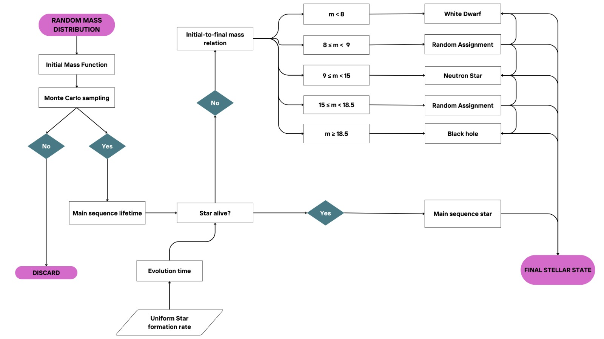

# Stellar Population Monte Carlo Simulator

A Monte Carlo–based Python tool to simulate and evolve stellar populations, from initial masses through stellar lifetimes, ending as white dwarfs, neutron stars, or black holes.

## Table of Contents
- [Description](#description)
- [Features](#features)
- [Flowchart](#flowchart)
- [Requirements](#requirements)
- [Installation](#installation)
- [Usage](#usage)
- [Documentation](#documentation)
- [Code Structure](#code-structure)
- [Output DataFrame](#output-dataframe)
- [Future Improvements and Contributions](#future-improvements-and-contributions)
- [References](#references)
- [Authors](#authors)
## Description
This project generates a synthetic stellar population by sampling initial masses from an initial mass function (IMF), assigning random formation times, computing stellar lifetimes, and determining whether each star is still on the Main Sequence or has evolved into a remnant: white dwarf (WD), neutron star (NS), or black hole (BH). The simulation returns a `pandas` DataFrame with the full history and properties of each star.

It is intended for computational astrophysics users who want a lightweight but flexible population synthesis tool. It can be used to study stellar remnants, SN rates, remnant mass distributions, and more.

## Features
- Monte Carlo sampling of initial stellar masses using the **Kroupa (2001) IMF**  
- Random star formation times and evolutionary durations  
- Determination of stellar lifetimes and survival classification  
- Final remnant mass prescriptions for:
  - White dwarfs: **Kalirai et al. (2008) IFMR**  
  - Neutron stars: **Raithel et al. (2018)**  
  - Black holes: **Raithel, Sukhbold & Özel (2018)**  
- Probabilistic transitions in the 8–9 and 15–18.5 solar mass ranges  
- Output delivered as a clean `pandas.DataFrame`  
- Fully documented functions using NumPy-style docstrings

## Flowchart


[Ver PDF](Flowchart_of_Stellar_Population_MC_Simulator.pdf.pdf)

## Requirements
This project requires:

- `numpy`
- `pandas`
- `matplotlib` (optional, recommended for producing plots)

Python version: >= 3.8

## Installation

Clone the repository:

```bash
git clone https://github.com/Gorzux/montecarlo_ast305
cd montecarlo_ast305
```
Use the package manager [pip](https://pip.pypa.io/en/stable/) to install core dependencies:
```python

pip install numpy pandas
```
Optional (for plotting):
```python
pip install matplotlib
```
## Usage
```python

from montecarlo_code_claudia_giorgos import main

# Run a Monte Carlo simulation
stars = main(quantity_MC=200000, seed=67)

print(stars.head())
print(stars["type"].value_counts(normalize=True) * 100)
```
This generates a full simulated stellar population.

## Documentation
All functions include NumPy-style docstrings, so you can explore them directly:

```python
help(main)
help(initial_mass_generation)
help(BH_mass)
```

## Code Structure
`initial_mass_generation()` — generate initial masses via IMF sampling

`evolution_time()` — assign birth times and compute evolution durations

`life_value()` — compute stellar lifetimes and determine survival

`WD_mass(), NS_mass(), BH_mass()` — remnant mass prescriptions

`get_final_mass()` — determine remnant type and mass

`main_mass()` — compute current mass (MS or remnant)

`main()` — runs the full pipeline and returns a DataFrame

## Output DataFrame
The output from `main()` is a pandas DataFrame with:

| Column       | Description                         |
| ------------ | ----------------------------------- |
| `Mi`         | Initial stellar mass (solar masses) |
| `Mf`         | Current mass (initial or remnant)   |
| `type`       | `"MS"`, `"WD"`, `"NS"`, `"BH"`      |
| `life_value` | Whether the star is still alive     |
| `t_birth`    | Formation time                      |
| `t_evo`      | Time since formation                |
| `t_life`     | Expected stellar lifetime           |
| `t_dead`     | Time since death (0 if alive)       |


## Future Improvements and Contributions

This project can be extended in many directions, including:

- Metallicity-dependent stellar lifetimes  
- Binary evolution pathways  
- Supernova energetics and explosion modeling  
- Star formation history models  
- Visualization utilities (HR diagrams, remnant mass distributions, etc.)

Contributions are welcome!  
If you wish to add new features or improvements, feel free to open a pull request.  
For major changes, please open an issue first to discuss your proposal.

## References

- **Kroupa, P. (2001)**
  
  On the variation of the initial mass function

  DOI: https://doi.org/10.1046/j.1365-8711.2001.04022.x 

- **Kalirai et al. (2008)**
  
  The Initial–Final Mass Relation: Direct Constraints at the Low-Mass End
  
  DOI: https://doi.org/10.1086/527028

- **Raithel, Sukhbold & Özel (2018)**
  
  Confronting Models of Massive Star Evolution and Explosions with Remnant Mass Measurements
  
  DOI: https://doi.org/10.3847/1538-4357/aab09b


## Authors
Claudia Álvarez Rojas & Giorgos Galanaquis Giovagnoli
